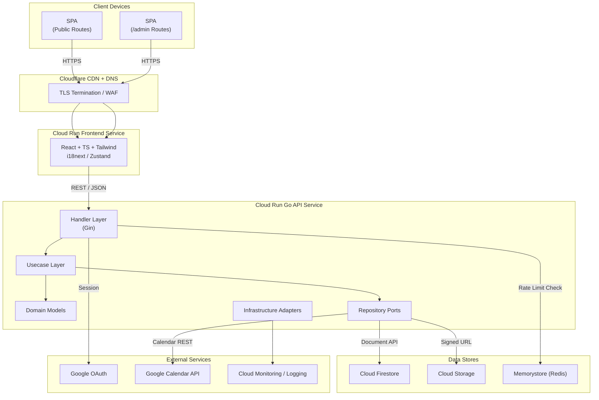
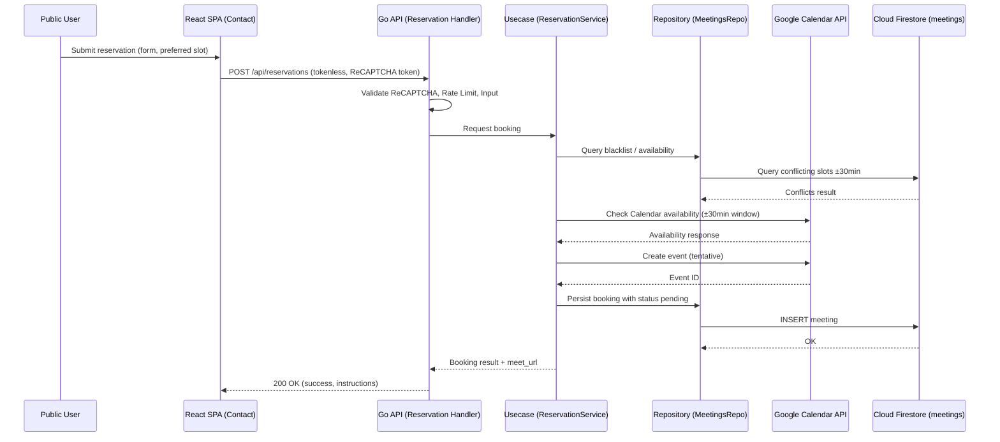
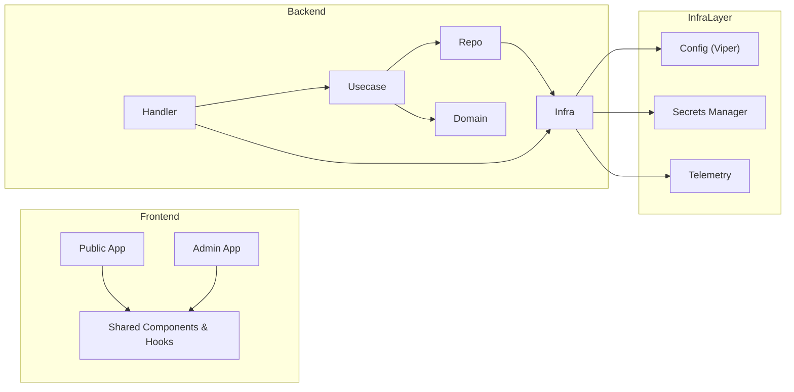

# 目的
- 改訂後要件（管理画面非表示、SSO、予約前後30分除外、レスポンシブ、追加セキュリティ等）を満たす Go + React + Firestore + GCP ベースの全体アーキテクチャを定義する。
- フロント・バックエンド・インフラ・外部連携を通した責務分割と依存関係を文書化し、後続フェーズの実装・レビュー・検証を円滑にする。

# 実装内容
- **システム全体構成**：Cloud Run 上でフロント SPA と Go API を個別デプロイし、Cloud Firestore と Cloud Storage をバックエンドに据える。Cloudflare で DNS/HTTPS 終端、Terraform で IaC 管理。
- **モジュール分割（Go API）**：`handler`（HTTP 入出力 & 認証）、`usecase`（アプリケーションロジック）、`repository`（DB・外部 API）、`domain`（エンティティ）、`infrastructure`（DI コンテナ、設定、クライアント管理）。
- **モジュール分割（React SPA）**：`apps/public` と `apps/admin` をルーティングで分岐し、共通 UI / i18n / API クライアントは `packages/shared` に集約。 `/admin` のビルドは Guard で保護し、通常ナビゲーションから除外。
- **認証・認可**：Cloudflare で HTTPS 強制。Google OAuth 2.0 を Cloud Run API に設定し、認証成功時に HttpOnly/Secure なサーバーサイドセッションを発行。管理 API はセッション + ロールで保護。公開 API は IP Rate Limiting + ReCAPTCHA で濫用防止。
- **予約ドメイン**：Contact フローで Google Calendar API と連携。30 分前後のバッファ除外を usecase 層で実装し、DB・Calendar 双方へ整合性書き込み。外部呼び出しは Circuit Breaker & Retry (指数バックオフ) を備える。
- **非機能対策**：slog による構造化ログ、OpenTelemetry Exporter、Cloud Monitoring Alert。キャッシュ層は Cloud CDN (静的) + API レスポンスの ETag/Conditional Request。DB クエリはインデックス計画と SQLX Prepared Statement。Rate Limiting は Redis 互換 Memorystore で固定窓 + バースト吸収。
- **DI / Config**：fx や wire 等の DI フレームワークで API コンポーネント生成。Viper で環境ごとに設定分離。認証鍵、DSN、API キーは Secret Manager 管理。

# コード






# 設定
- **ディレクトリ構成**：  
  ```
  /frontend
    /apps/public
    /apps/admin
    /packages/shared
  /api
    /cmd/server
    /internal/handler
    /internal/usecase
    /internal/domain
    /internal/repository
    /internal/infrastructure
  /infra
    /terraform
    /cloudbuild
  /ops
    makefile targets, scripts
  ```
- **環境変数**：`APP_ENV`, `PORT`, `APP_FIRESTORE_PROJECT_ID`, `APP_GOOGLE_CLIENT_ID/SECRET`, `APP_AUTH_JWT_SECRET`, `APP_AUTH_ADMIN_SESSION_TTL`, `APP_SECURITY_CSRF_SIGNING_KEY`, `APP_BOOKING_*`, `RECAPTCHA_SECRET`, `RATE_LIMIT_RPS`, `CACHE_TTL_SECONDS` 等を Secret Manager で管理し Cloud Run に注入。
- **ネットワーク構成**：Cloudflare → (HTTPS) → Cloud Run → Serverless VPC Connector → Firestore / Cloud Storage。Firestore には IAM 認証で接続。Memorystore/Cloud Storage も VPC 経由。
- **CI/CD**：GitHub Actions → Cloud Build。Actions で lint/test。Terraform Plan/Apply は承認付き。Cloud Build が Cloud Run/Storage へデプロイ。Artifact Registry にコンテナ保管。
- **セキュリティ設定**：Cloud Armor で WAF ルール、OWASP Top10 対応の Security Middleware（Helmet 相当）、セッション Cookie のローテーションと TTL 管理。Cloud Run ingress を internal + Cloudflare 経由に限定。

# テスト
- **依存循環検知**：Go は `go list -json ./... | go vet` + `golangci-lint` の `depguard`。React は ESLint `import/no-cycle`。CI で必須化。
- **データフローバリデーション**：Contract テストで REST schema (OpenAPI + Dredd) を検証し、Calendar API モックで予約ワークフローの整合性をチェック。
- **非機能検証**：k6 による Rate Limit／キャッシュ命中測定、Lighthouse モバイル/デスクトップスコア確認。OWASP ZAP で API の TLS/ヘッダ検証と脆弱性診断。
- **DI/Config テスト**：Wire/Fx の build/test ターゲットで依存グラフが生成可能か確認。設定は `envconfig` テストで必須キー欠落を検出。

# 検証方法
- `golangci-lint run` と `eslint --max-warnings=0` で循環依存・静的解析をパスすることを確認。
- OpenAPI スキーマに基づき Postman Collection で公開/管理 API の一貫したレスポンスを確認し、DB と外部 API が期待通り連動するかをステージング環境で演習。
- Cloud Monitoring ダッシュボードに TLS 成功率、Rate Limiter ヒット、キャッシュヒット率を可視化し、アラート閾値を検証。
- Terraform Plan をレビューしてネットワーク・Secret・権限が設計通りであることを承認プロセスで担保。
